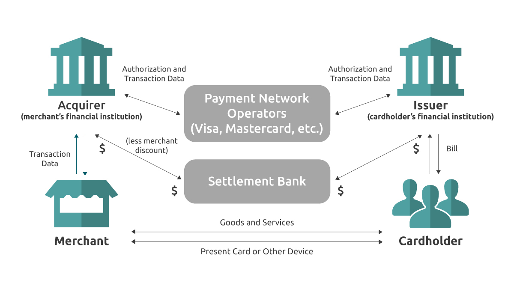
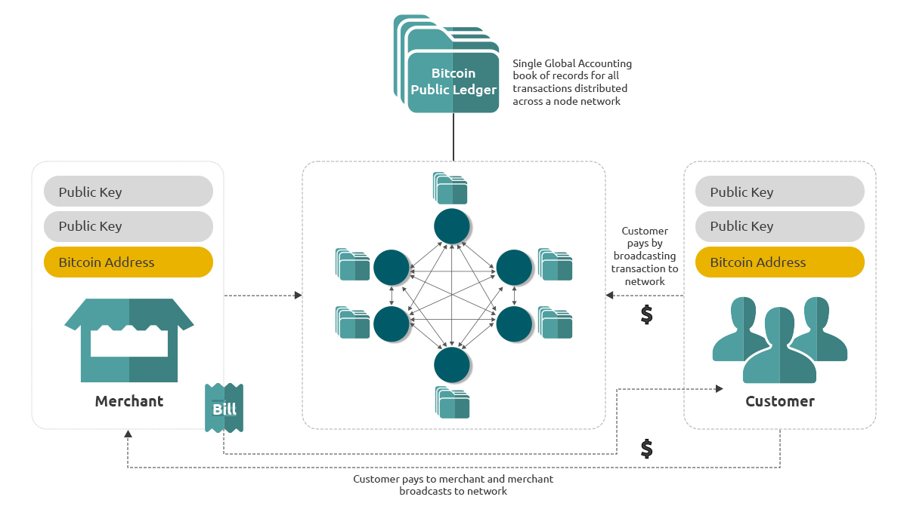
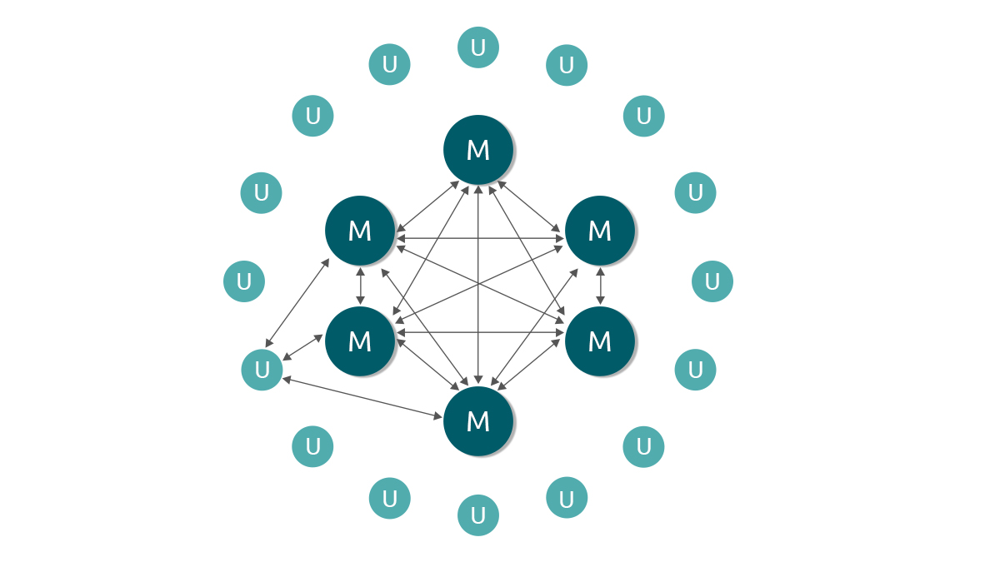

The Bitcoin protocol is a special set of rules implemented using an economic model and crpytographic tools to create a system which solve two major issues in electronic payment systems :

1. Double Spending :
   Previously the most significant obstacle in creating an electronic cash system was the issue of double spending. Double spending means that the same set of digital money is spent twice by the owner and there is no easy method to prevent it. Existing digital cash solutions introduced centralised mechanisms to monitor all transactions and prevent double spending. The centralised nature of these systems created a bottleneck that needed to be trusted for the validity of the system. Bitcoin solves the double spending problem without the need of a centralised system by publishing all transactions publicly. The only way to confirm the absence of a transaction (Spending same coins twice) is to be aware of all transactions. To accomplish this without a trusted party, transactions are publicly announced. The network follows something called the first seen rule, which means that the first transaction seen spending coins is considered by the network as the legitimate transaction. This works in conjunction with another significant innovation of using a UTXO (unspent transaction output) system in place of the traditional system of Accounts which gives a unique history to every coin that exists in the system tracing back to the “minting” or “genesis” of the coins.

2. Solution to Byzantine Generals Problem ( or BFT ) using a Proof of Work System :
   When the records of transactions are being stored, most traditional systems have an extensive and complicated clearing and settlement systems to ensure the correctness and completeness of the accounting of money. Bitcoin solves this quite elegantly by creating a network of nodes at the centre of the network which typically will do the work of transaction verification and validation. These nodes perform what is called proof-of-work, a process which uses CPU to cycle through combinations of “nonce and block header” resulting in a hashed and timestamped record of all valid transactions received from the start of the cycle in what is called a block. The very nature of the proof-of-work process is such that it cannot be faked, misrepresented or otherwise it is falsified. Bitcoin node software, which encodes the protocol for creation of a network, maintains the transactions that happen on the network replacing the traditional silos for such processing. These nodes compete using a set of network rules which requires them to spend computing power to solve a mathematical problem or a “computation puzzle”. This “computation puzzle” is typically solved in around 10 mins by one of the nodes in the network and they “win” the competition. The reward they get is a set of new coins to be introduced in the system and the transaction fees from the transactions they commit to the ledger. This replaces the previous components of trusting a central node in the network to act honestly with a system to incentivizes honesty. Nodes make money only if they act honestly, and lose money if they are dishonest due to the extensive computation involved requiring spending energy.

This unique system solves not just the problem of creating an electronic form of money and enabling peer-to -peer transfer of money, but it also serves as a protocol to store and exchange data. This is why it is called Bit-Coin where Bit means information and Coin means money. This system in short takes out a lot of complexities built in the existing system due to legacy architecture, Silos and complex infrastructure built over decades of learning and building systems and simplifies that to be a truly simple, Peer to Peer electronic cash system which is demonstrated in the graphics comparing a credit card-based payment transaction touchpoint in the current financial systems v/s what it will be in a Bitcoin based system.

In the Bitcoin based Merchant POS, a merchant will either take the payment directly from the customer or will wait for the customer to broadcast it to the network and confirm the transaction happened from the network by checking his Address for the receipt of funds.

The aspects of invoicing and accounting records also are simplified if they don’t stay the same, but with an added advantage of using a global public accounting ledger which introduces transparency, permanency, availability and audibility by design of this system.

Highlights of the difference between the two are :

In place of multiple third parties (banking institutions, intermediary and settlement banks) we have only one third-party which is played by a number of competing nodes of the Bitcoin network reducing the number of hops (two or max 3) a transaction has to take to reach the intended recipient.

The customer (directly or via merchant) only has to send the transaction via his software to the node network to update on the Bitcoin ledger. Once updated in the ledger, the merchant owns the money so this simplifies the overall business process and again removes the reversibility of the transaction.

In place of user accounts and the various sets of the payment transaction and network, all coins are associated with a private/public key pair using ECDSA making it extremely secure.

Transactions that are computationally impractical to reverse would protect sellers from fraud, and routine escrow mechanisms could easily be implemented to protect buyers.

If there is a legal dispute due to which the transaction can become invalid, it would be possible to reverse the transaction but typically that will only happen for something that is ordered by a court of law and is significant in value due to the huge effort involved in it.

In addition to this, the ledger where the accounting entries are made (Bitcoin public ledger) is distributed across the globe via the network of nodes making it resilient to any single point of failure scenarios. This forms the central core of the Bitcoin network. The Bitcoin network will look like as shown in the graphic, where M are the mining nodes which are hyper connected with each other and U are the user nodes which are connected by their need to one or more mining nodes.

<h3 align="center">Graphic : A bitcoin network approximation</h3>

The user nodes are not really nodes as they do not participate in the proof-of-work process, but they typically are a lightweight node which only stores hashes which represents a block or collection of transactions, for all blocks. One single block hash can represent not just the block Id, but also is a sort of “checksum" for the block since it is created by a constant hashing of underlying transaction data in a special binary tree structure known as merkle tree.

This enables user nodes to be very small in size and simple in operation (typically around 50 MB for complete Bitcoin ledger). This makes them quite easy to install and use for users. These nodes also act as Blockchain’s integrity validator since they have a Hash value stored for every block from Block # 0. If any tampering happens by dishonest mining nodes trying to create alternate history, user nodes act as validators since their block header hash validation will fail with these alternate history block header hash checks, when validated. The center of the network is made of the full nodes who are running complete Bitcoin protocol software and store complete Bitcoin ledger among other things. These nodes act as a non-trusted third party and are in a constant process of participating in the next block discovery process.

This distributed Bitcoin ledger is the first practical implementation of triple entry book-keeping. The idea of keeping two books (one of the creditor and the other by the debtor) is what current financial systems are built on, which leaves room for the possibility of many errors (one book’s entries not matching other book’s entries). Bitcoin introduced the third copy which is a global public ledger as the source of truth and in turn a triple entry accounting and bookkeeping system. This implementation removes a lot of existing issues with double entry bookkeeping and also provides a truthful trail for audit as well reducing silos, and easy audibility of accounts for both the participants in the trade.
