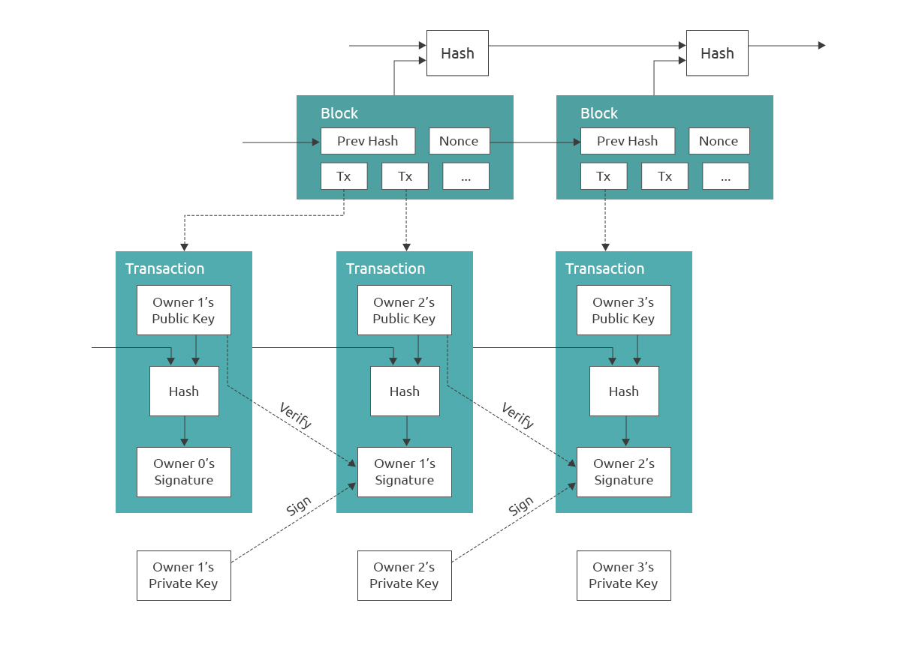
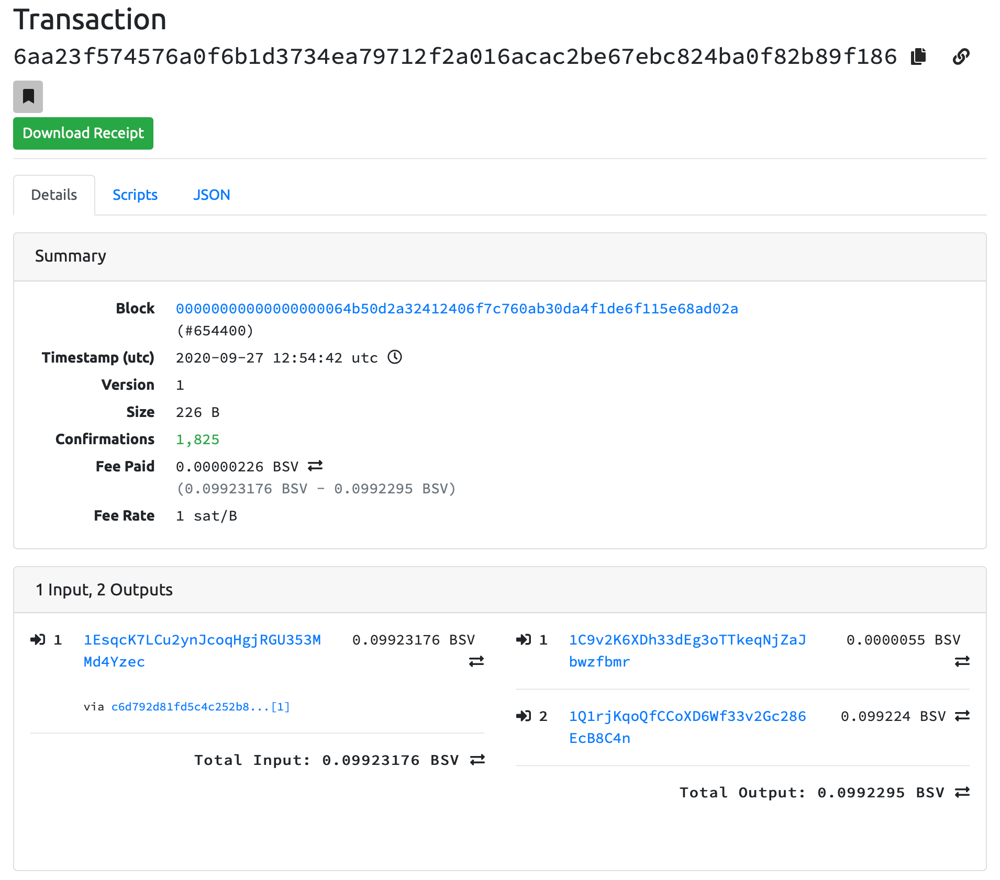
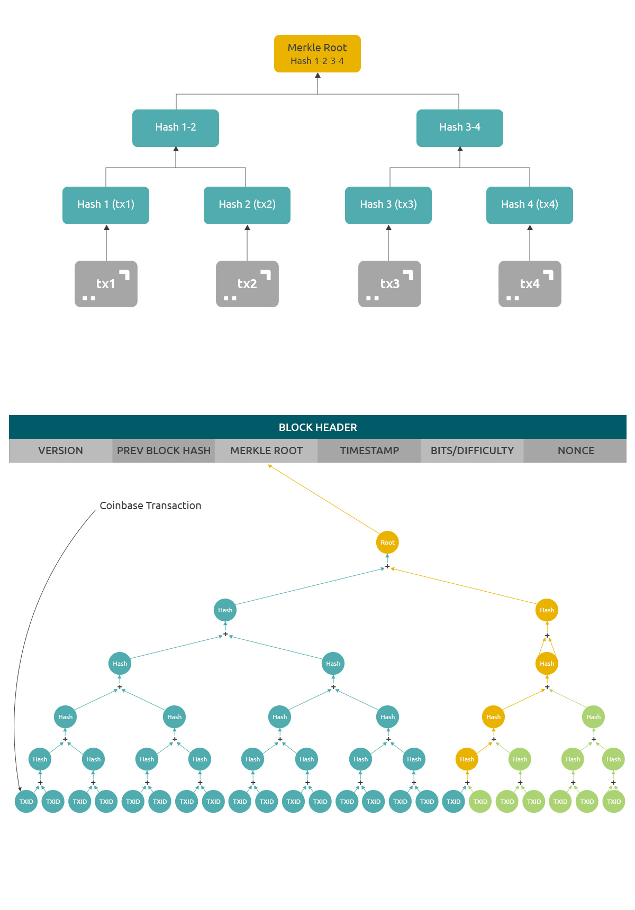
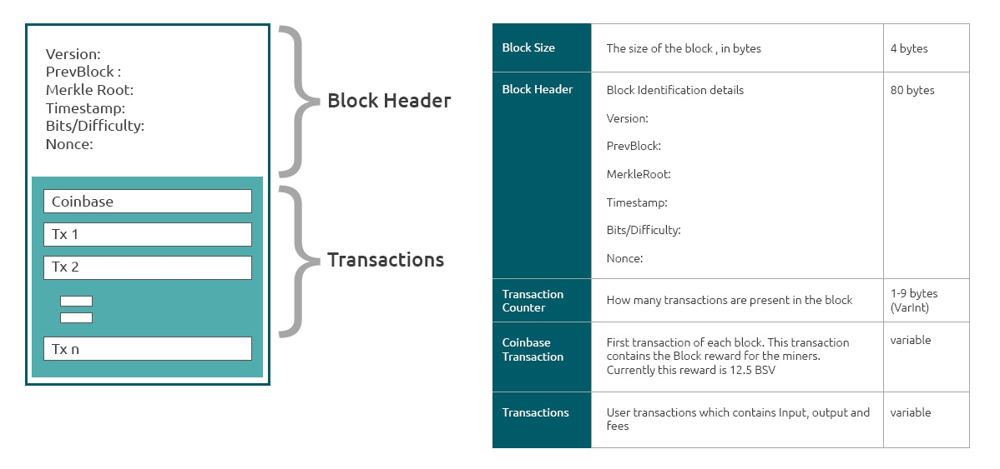
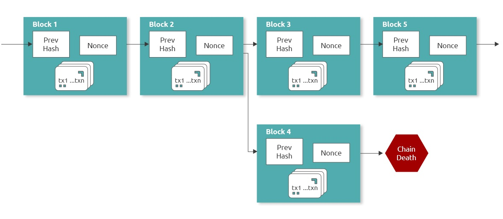
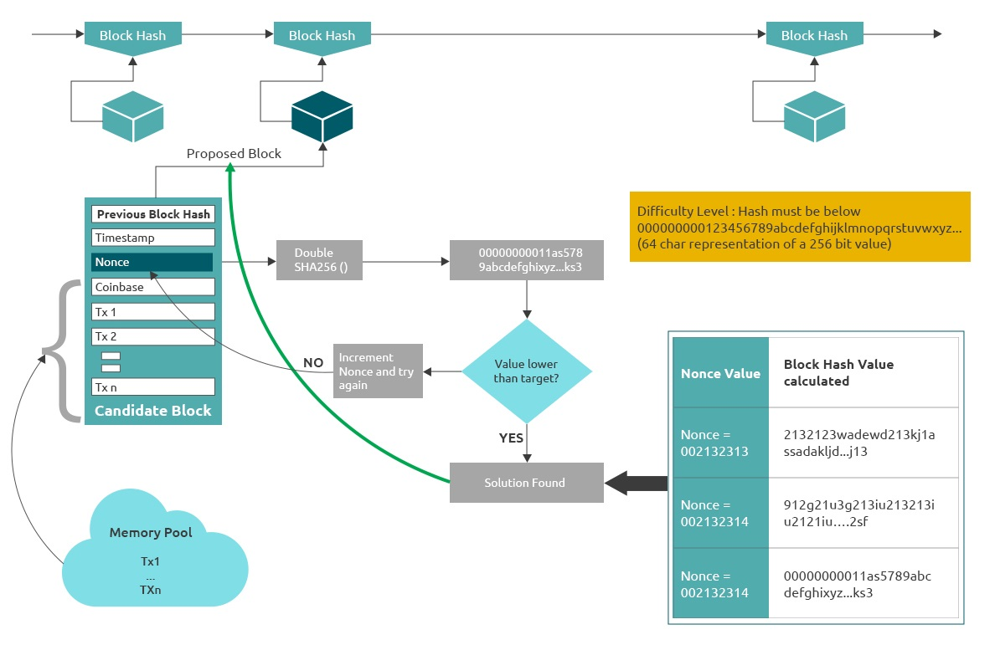

Coin

The maximum number of bitcoins that can ever be created is 21 million. Currently about 18,500,000 bitcoins are already mined and are in circulation. As per the mining schedule, by the year 2140 all of the possible bitcoins will be mined and from then nodes will purely have to depend on transaction fees for their rewards.

An electronic coin is defined as a chain of digital signatures and an owner transfers the coin to the new owner by a transaction. A transaction consists of an input record (owner digitally signing the hash of the previous transaction) and the public key for the next owner (recipient).

<h3 align="center"> Graphic: Transactions and Blocks in Bitcoin </h3>

This diagram above shows how a transaction is in terms of its components and ownership of the coins that a transaction is made to transfer. Payee or recipient of a transaction can always verify the validity of the transaction by using his private key to validate the transfer of ownership via this transaction as shown above. These transactions are batched together in a Timestamp server which takes the Hash of the batch of transactions and then widely publishes the hash as shown in the Graphic. This timestamp proves that the transactions must have existed at the time, obviously, in order to get included into the hash. Each timestamp includes the previous timestamp in its hash, forming a chain, with each additional timestamp reinforcing the ones before it.

Money is integrated in this system in the form of something called UTXO. This is quite different from the traditional model of money storage in electronic form which typically uses the idea of an account and then the transfer of money from one account to another account. In this case, both accounts being held by one or more trusted third party (banks for ex.) on behalf of the original owner of those funds.

UTXO is an acronym for Unspent Transaction Output, which literally means that they are the unspent coins that are present in an output created by a transaction. When the Bitcoin network was launched, the complete supply of coins, that is 21 million, was created but were not distributed in the network. The distribution of these coins happens with the Proof-of-Work process discussed earlier.

The typical distribution involves a minting or “Coinbase” transaction, which is created by the node adding the block as the first transaction in the block. This transaction will assign the node itself a set of coins defined by distribution rules of the network, which currently is 6.25 bitcoins per block reward. This transaction will have input as “Coinbase” and output will be 6.25 bitcoins locking them to node’s Public key. Likewise, all of the coins that exist in the network are first created by a Coinbase transaction and then on transferred from one owner to another and at any point in time exists as a set of coins which are present in millions of these transaction outputs. Hence the acronym, UTXO.

All UTXOs at a given time can be collected into a set, called the UTXO set and this set represents the current state of ownership of all Bitcoin in existence at any point in time. The inputs of transactions that are proposed for addition to ledger are checked against this set. If an input to a transaction is an output in the UTXO set, the input can be validated. The UTXO set is deterministic for every Bitcoin block, that is, every node who has validated the history of the Bitcoin ledger up to a particular block should have an identical UTXO set. This is required in order for nodes to reach consensus on the validity of inputs in new transactions. This innovation provides for getting rid of the complete idea of static accounts which are commonly used in current financial systems.

UTXO themselves are not the coins but are analogous to envelopes which store the real electronic unit or tokens of value in this system, called a Satoshi. One Satoshi is always = One Satoshi. A UTXO typically right now is looked into terms of a Bitcoin where 1 Bitcoin = 100,000,000 Satoshi. The 1 Bitcoin or 1 BSV here is an envelope which stores 10 raised to 8 Satoshi tokens. So at any point of time the bitcoin network contains N number of “coins” or “bitcoins” which are UTXO envelopes of the Satoshi tokens held in locking scripts that typically use ECDSA cryptography.

The Cryptography involves the Private and Public Key pairs where the public key is really a value derived by Private key ergo the coins are locked using the private key. A transfer of coin means the owner of one envelope electronically transfers full or part of the tokens present in the envelope to the intended owners by locking these coins to their public key. These coins can only be unlocked by the intended owner’s private key. These transactions always will need a small number of tokens to be paid to the non-trusted third party, the network of nodes who maintain the ledger and the transactions validity and integrity. All existing UTXOs at any point in time are accounted for and maintained in the blockchain which is analogous to an accounting ledger containing both the credit and debit entries.

One last thing to elaborate about Bitcoin is the misnomer that Bitcoin is a cryptocurrency. The word crypto comes from cryptic and currency means a legal tender from a sovereign government of a country. Bitcoin writes all transactions on a global public ledger in cleartext and it's probably the best method to use if you want to add transparency, traceability and audit-ability into a system. It is exactly opposite of Crypto and as per many rulings by supreme courts of various countries like USA, India and others, it is deemed at best a commodity but not a legal tender, so it is definitely not a currency either. So the adjective, misnomer. Bitcoin is not a cryptocurrency, but is it money? Yes, it could be if there is an inherent value that arises out of usage of the coins. It is a form of digital asset (Property with property rights) in the closest way of defining it legally.

Bit

Apart from just being the protocol which allows money or value exchange between two entities, Bitcoin also has provisions to add data to these transactions. This enables users to add various kinds of information to a transaction like a text message, an image file, application code, or metadata. In fact, this is such a huge part of Bitcoin that this course will have many chapters dedicated to talking about how to append a blob of data along with the transactions and use Bitcoin as a data storage entity.

Bitcoin from the start was designed to support various sizes of data bytes in a transaction which goes up to about 4 gb per transaction but due to historical reasons most of this capability was restricted in many years of operations of the network. Bitcoin transactions input and output contains a script which has designated codes to append data. In the last couple of years these restrictions are gradually being removed in addition to creation of node software which can support such data while processing transactions.

Just one small change of supporting data via a script code known as OP_RETURN created an explosion of protocol development using the 100 KB data allowed with the transaction by the network of nodes earlier in 2018. Since then things have been changing with much more data inclusion possible with some other script codes known as OP_PUSHDATAx.

This is the Bit part of the Bitcoin network. Bit meaning information, is possible to be stored in the Bitcoin ledger in a manner that makes it something similar to a notarised entry. Once the data/information or Bit is updated on the ledger it becomes a timestamped entry of that data which in future will be available globally and in a public manner. One basic example of usage of something like this is an existence of a contract between two parties, which they can create and store as is with themselves as they do now, but in addition to that, they hash (SHA256 or other) the digital format of the contract and store that hash in a transaction (which will need a cost of less than 1/100 of a cent).

Later on, if one of the parties tried to manipulate even a single character written in that contract, it will generate a completely new hash making it impossible for either of them to tamper with. And this record will be available at all times till the Bitcoin network exists, which means for an infinite possible timeframe from now. Such property of the usage of network allows for a plethora of utility of using this network for storing not just contracts, but also application database, legal documents, billing and invoicing and for that matter something as simple as weather data for immutable history archiving.

Hashing of data plays an important function in this to act as checksum and ensure immutability for the underlying data, but still keeping the work to be done to do the verification quite trivial. This is demonstrated by a small example - by hashing a text explaining what is hash and then by changing a single character which is the first letter 'A' but keeping everything the same and displaying the two SHA256 hash values.

    // node terminal, using BSV library

const bsv = require ('bsv')
var M = '“ A Hash is a cryptographic function with its unique property that it can transform a given input to a fixed number of alphanumeric strings. The input provided can be numeric, alphanumeric, media files, binary files. The output hash can be chosen to be 64-bit, 128-bit, 128-bit or 256-bit depending on the choice of the hash algorithm. Another unique property of this hash function is that it is a one way function, which means there is no way to generate the data if someone has the hash with them. This effectively means that even a one character change in the input data, can completely change the value of the hash output. These two unique properties enable the use of this hash function as a digital fingerprint for the data processed through the function. “ '
var M1 = '“ Hash is a cryptographic function with its unique property that it can transform a given input to a fixed number of alphanumeric strings. The input provided can be numeric, alphanumeric, media files, binary files. The output hash can be chosen to be 64-bit, 128-bit, 128-bit or 256-bit depending on the choice of the hash algorithm. Another unique property of this hash function is that it is a one way function, which means there is no way to generate the data if someone has the hash with them. This effectively means that even a one character change in the input data, can completely change the value of the hash output. These two unique properties enable the use of this hash function as a digital fingerprint for the data processed through the function. “ '
var HM = bsv.crypto.Hash.sha256(Buffer.from(M)).toString('hex')
console.log(HM)
// displays '664a9df50be3d1eb7afa0875e00fa998bd30d1ffe91a8fa7af8e213fd13a7444'
var HM1 = bsv.crypto.Hash.sha256(Buffer.from(M1)).toString('hex')
console.log(HM1)
// displays '71f1b520c2cf59baf9e29d29ea48bb2cb71f56d36157af37786a564b8108fc24'
//Both HM and HM1 are completely different values as shown.

Block and Transactions

Each transaction once created, will have a hash generated for it using the SHA256 algorithm and this is how the content and a transaction looks like for transaction with Hash: 6aa23f574576a0f6b1d3734ea79712f2a016acac2be67ebc824ba0f82b89f186

<h3 align="center">Graphic: A typical bitcoin transaction</h3>

As you can see each transaction has some metadata for it (timestamp, confirmations, fee paid, block number) and then there are details of input and output for the transaction. All the data that belongs to the transaction is put through the SHA256 hash function (twice !!) and a 32 byte and 64-character length hash for the transaction is created. In a typical scenario, the network receives n number of transactions in a time period where the nodes in the network are trying to solve the Proof-of-work problem to find the next block hash and these nodes will in parallel create the block of transactions that they receive from various sources. These nodes will further do cascading hashing of transaction hash as well in a form of something called a Merkle tree.

In cryptography and computer science, a hash tree or Merkle tree is a binary tree in which every leaf node is labelled with the hash of a data block. This is shown as the Hash (tx1), Hash (tx2) etc in the left graphic. Every non-leaf node is labelled with the cryptographic hash of the labels of its child nodes ex. as Hash 1-2 and Hash 3-4. Hash trees allow efficient and secure verification of the contents of large data structures.

If there are an odd number of transactions, suppose there is no tx4, the hash 3-4 will just be the hash 3-3 by using tx3 hash twice and the same process applies. Demonstrating that a leaf node is a part of a given Merkle tree requires computing a number of hashes proportional to the logarithm of the number of leaf nodes of the tree. The right Graphic shows how the node will keep building a block as it keeps receiving new transactions by updating the Merkle tree root. All this data while kept on the higher abstraction of what is known as a Block.

<h3 align="center">Graphic: A Merkle root hash representation for a block with 4 transactions (top) and a typical creation of a merkle root in a block (bottom)</h3>

This merkle root acts as a checksum and even if a small character in a single transaction changes will break the integrity of this information and the change will render the block invalid and hence not accepted by consensus/validation process of nodes. The structure of a block looks like this.

<h3 align="center">Graphic: Structure of a block</h3>

Once the hash of the transactions are stored in a block with timestamp, it becomes a publicly stored record of truth which cannot be tampered with by any means. These blocks stored chained with each other acts as a timestamped server for the information stored in them. The nodes participating in the proof-of-work use computational power to generate a hash for the next block that they are competing to add to the existing chain of blocks. This new hash to be generated is controlled in terms of how complex it is to generate by one of the fields mentioned in the block header called nonce.

Nodes use their computational power, continuously scanning for a value that when hashed, such as with SHA-256, the hash begins with a leading number of zero bits. The nonce defines these leading numbers of zero bits to control the difficulty of this process and is done by incrementing it in a block until a value is found that gives the block’s hash the required zero bits. The average work required is exponential in the number of zero bits required and can be verified by executing a single hash.

The process of using a proof of work system to make a block ensures that the block cannot be changed once generated without redoing the same amount of computational work. You can also see that as there are more blocks chained after any block, the work to change said block will include changing all of these blocks that are chained as well and this way the work to alter the block increases exponentially as the depth of the block increases in the block chain.

The last step in the selection of blocks involves a number of nodes coming to an agreement that the winning node’s block is what they all agree to add to the Bitcoin ledger by a network consensus proved by the winning node’s proof of work. All of the nodes who are investing their CPUs vote in this network consensus to decide on the majority decision for the next block addition and block winner among them by a consensus method described as Nakamoto consensus which is: “Proof-of-work is essentially one-CPU-one-vote”.

They do it by taking the selected node’s block and start to build the next block hash using this node’s block. There is always a possibility that multiple nodes solve the hash puzzle at the same time and the single chain may have a fork happening from time to time. This automatically will resolve as the network will keep adding new blocks to one or the other fork and the majority of nodes decisions will be represented by the longest chain demonstrating greatest proof of work.

<h3 align="center">Graphic: A temporary fork or orphaning of a block in the bitcoin blockchain network.</h3>

The network splits are possible but eventually the longest chain is the one that survives and these forks dies off. These are meant to be uncommon but perfectly natural scenarios. The block is usually referred to as orphan block and usually block 3 and 4 will be added to something called an orphan pool and it's only when the next block is added one of the orphan blocks becomes the confirmed block. In short, an orphan block has a parent block but no children blocks. This is the reason a Coinbase transaction coins are only allowed to be spent after 100 blocks are added to the block where Coinbase is present. The obvious concern here in the case of chain death scenario is that what happens to the transactions that were included in block 4 but not in block 3, do those transactions also die along with that fork?

The answer is quite simple. No. Nodes receive the transactions from individual wallets or business nodes, not all at the same time. All of these transactions are collected in something called a mempool. This can be considered as a temporary storage area where nodes pick up transactions to make the new block. If the node who mined block 3 did not pick up some transactions that were included in block 4, a node who has (during network consensus) agreed to the transactions included in the block 3, will consider those transactions not yet included in the blockchain and hence a valid transaction and will include them in the block 5.

The last bit about mining is the concept of Bits. This is a parameter which is used to control the difficulty of the block hash that is to be generated. The value is relooked at every two weeks and is determined by a moving average targeting an average number of blocks per hour. If they're generated too fast, the difficulty increases and vice versa to keep block generation to an average of one block every 10 mins. The overall process is demonstrated in the graphic.

<h3 align="center">Graphic: Representational process of Block hash computation by nodes</h3>
