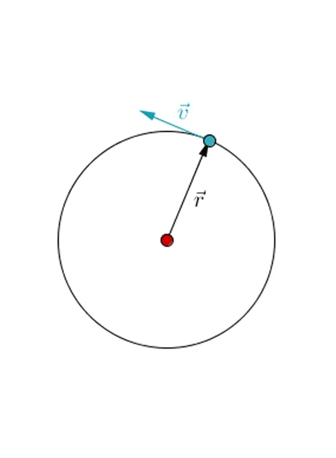
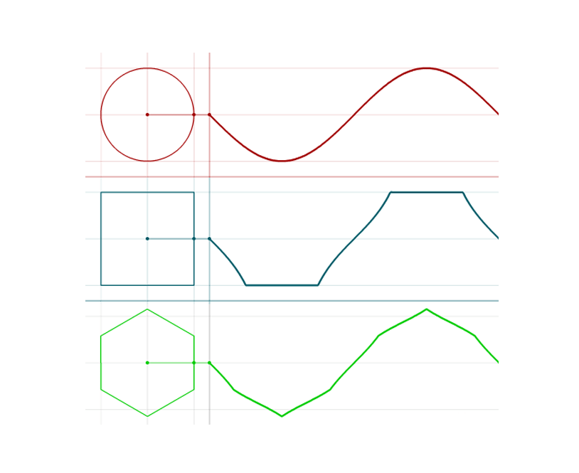

The beauty of a Bitcoin ledger and protocol is that it is one system, but it can be used as many different things depending on how you see it and use it. It can be abstracted as a Database, a Turing Tape, Accounting book, system log etc. All of these abstractions allow for using the network and ledger to build systems that need such abstractions. Let us look at some of these abstractions.

Infinite Database: Bitcoin ledger used for storing data can be used infinitely as long as you pay the small one-time network fee for the transactions. If not the nodes who participate in the network, there will be specialised nodes in future who work as archiving nodes for the data stored and provide the data retention services. This means that the APIs that you build can work indefinitely till the bitcoin network is functional in a way enabling the creation of infinite APIs. In a later chapter we will talk about the Planaria framework which works as a RAM accessing this infinite database (bitcoin) on a real time basis and updating every event filtered by application specified criteria. One huge benefit of bitcoin over other databases is that the data stored is never corrupted (distributed network keeps multiple copies), if you mess up and lose records, you can always rewind and recreate the database, so it also provides excellent failsafe measures.

Infinite universal spreadsheet: This is another way of looking at the universal public Bitcoin Ledger. Since everything recorded is a transaction between two parties, it is kind of a distributed global spreadsheet available to anyone who is willing to pay the tiny amount of fee to update it and has a window to view a subset or whole of it. It can also be thought of a global accounting book.

Infinite Motor: If you see, Bitcoin is cyclic. It has an approximately 10 minutes cycle which the network keeps repeating. But each cycle is unique in its own way and its content which is made up of a selective history of the human interactions that are selected and logged into Bitcoin. It’s this property if we think further, we can think of Bitcoin as a perpetual rotating machine, an infinity motor, which (based on its algorithm) is capturing transactions by navigating in time and producing them as events.

This "motor" travels through time and collects all the events (transactions) that happen through each rotation and takes an immutable snapshot (a block). The rotation logic (Bitcoin's algorithm) is deterministic and secure (powered by Proof of Work), making it the perfectly stable piece of technology to power all kinds of useful machines.

So now that we have established an abstraction, Bitcoin == Motor

We can then think about how to build a machine with a motor (Bitcoin). But first, what exactly is a "machine"?

A machine is a function. A machine takes the motor as the constant source of energy and transforms the energy into various forms that can be consumed by humans or other machines.

Machine = F(Motor): You can create an infinite number of "machines" from a single reliable motor, which is Bitcoin.

