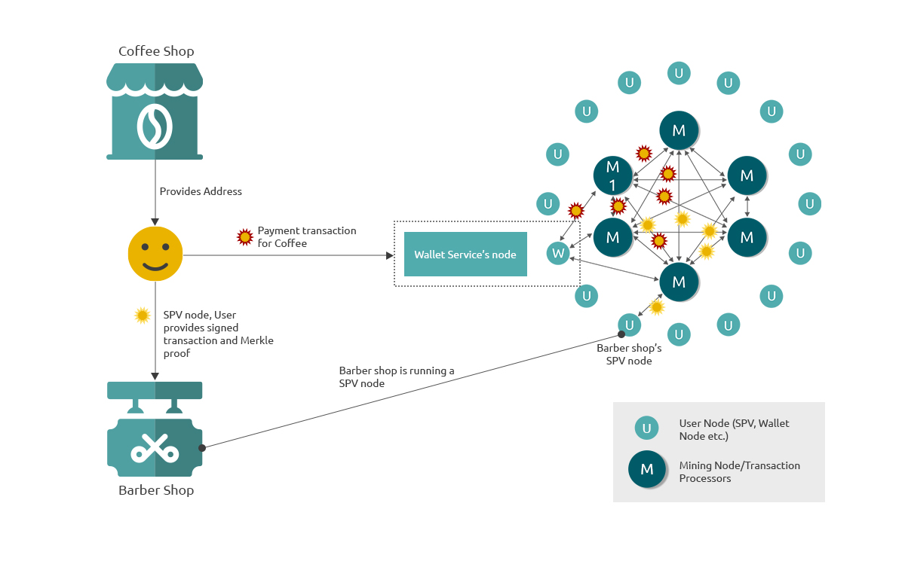

Typically, the creation of a Bitcoin transaction and storing of Satoshi tokens/bitcoins are performed by a software for key management called a wallet. Additionally, a wallet can provide functions related to creating and sending transactions, sending messages with the encryption using the same keys which are locking the coins and many more depending on how advanced the wallet software is.

There are different types of wallets as well some even storing the keys on the behalf of users becoming custodial wallets. Most of the exchanges (cryptocurrency) perform this role of being custodian of their users and are custodial wallets. Others which provide a Software for users to install and use are non-custodial wallets like the electrumsv and HandCash wallets. There are also wallets like the Moneybutton wallets which don’t need a software and are web-based products but still require users to own and store the keys (or the seed phrase used to generate the keys) and continue to stay non-custodial wallets.

There is also an important concept of SPV. In short, an SPV is a lightweight client which only stores the block headers and merkle roots which are the only things needed for verification of a transaction being valid or not. More details about the SPV client are provided in the wiki: https://wiki.bitcoinsv.io/index.php/Simplified_Payment_Verification.

SPV is most useful for proving a payment happened. Especially when small value payments are confirmed instantly (zero-confirmation) this happens due to a SPV check or SPV proof that ensures the merchant taking the payment that this is not a double spend and it is a valid payment to accept even though it is either yet to be mined or processed in a block by the mining network. For large value payments it is still advisable to wait for few block confirmations so as there is no possibility of the transaction being lost in orphan blocks. We will discuss SPV in more detail when we talk about Payment protocols in a later chapter.

Wallet clients typically provide not just key management but also transaction management capabilities. They will abstract most of the low-level functionality of building a transaction using the user keys and allow for a similar user experience that any payment wallet does. Once the transaction is created, the next step to this will be for the user to broadcast this transaction to the bitcoin network.

This is done either by the user directly broadcasting the transaction (if using a SPV wallet) or the wallet service provider broadcasting it on the behalf of user. Typically, the wallet service provider will have a few selected nodes which they will broadcast these transactions to and then it is the responsibility of the node to propagate the transaction to the rest of the node network. One important concept to note here is that the node network typically are hyper connected with each other so the overall propagation of transactions happens quite quickly (milli seconds or less).

<h3 align="center">Graphic:User broadcasts transaction to a node, then the node propagates across the network</h3>

The Graphic shows the broadcasting and propagation of a transaction to the bitcoin network. At the centre of the network is a hyper connected (small world) network of nodes which are the mining or transaction processing nodes. The real transaction processors are only the nodes that produce blocks, not even all the nodes which are participating as only the ones that produce blocks are contributing to the updating of Ledger. There is one more concept of block difficulty adjustment which happens approximately every 2 weeks which metaphorically means that the game of mining and finding the puzzle solution is reset and restarted every 2016 blocks or about 2 weeks. This means that only the nodes that are able to produce a new block in this window matters to the bitcoin network, none of the other nodes really count as a node/transaction processor. The users form the outer layer in the network which are connected to one or more nodes. This effectively makes the network distance between two user nodes a max of 3 and the network distance for a broadcasting transaction of 2 hops or maximum of 3.

When building an application where there are users from across the globe creating and sending transactions, it will typically be done either using a wallet service or doing this work of broadcasting in the application itself (this will mean the application will be hosting a wallet service as well). On the other hand, for different types of applications which focus on reading the bitcoin ledger, you can easily build things like event listeners which can listen to transactions with specific attributes that the application has, identifying them for an action or future reference. But this can be flipped around as well, where it can be an application that monitors the bitcoin network for certain type of transactions generated by other applications and can build use cases around them.

One good example will be a visualisation application for social media networks storing all transactions on chain (on bitcoin ledger). This new visualisation uses other application data but builds its own social media network version of it. There can also be applications using other applications data referenced for various purposes, for example a location based social media network which needs to show weather data for that location, can use the data stored on the bitcoin ledger by an application which purely stores weather data for a large number of locations across the globe. These are just a few basic examples but there are and will be large consequences of these kinds of properties in future to come.
